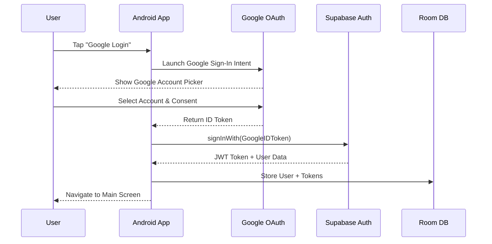

# Google OAuth + Supabase 인증 플로우

## 전체 인증 아키텍처

```
┌─────────────────┐    ┌─────────────────┐    ┌─────────────────┐
│   Android App   │    │     Google      │    │   Supabase      │
│                 │    │     OAuth       │    │     Auth        │
│  ┌───────────┐  │    │                 │    │                 │
│  │  Google   │  │◄──►│   OAuth 2.0     │◄──►│   JWT Tokens    │
│  │  Sign-In  │  │    │   Servers       │    │   User Session  │
│  └───────────┘  │    │                 │    │   RLS Context   │
│                 │    │                 │    │                 │
└─────────────────┘    └─────────────────┘    └─────────────────┘
```

## 인증 플로우 단계

### 1. 초기 설정 및 구성

#### Android 앱 설정
```kotlin
// build.gradle.kts (app)
dependencies {
    implementation("com.google.android.gms:play-services-auth:20.7.0")
    implementation("io.github.jan-tennert.supabase:gotrue-kt:2.0.0")
    implementation("io.github.jan-tennert.supabase:supabase-kt:2.0.0")
}
```

#### Supabase 클라이언트 설정
```kotlin
val supabase = createSupabaseClient(
    supabaseUrl = "YOUR_SUPABASE_URL",
    supabaseKey = "YOUR_SUPABASE_ANON_KEY"
) {
    install(GoTrue)
    install(Postgrest)
    install(Realtime)
}
```

### 2. Google OAuth 로그인 플로우



### 3. 인증 상태 관리

#### AuthManager 인터페이스
```kotlin
interface AuthManager {
    val currentUser: Flow<User?>
    val isAuthenticated: Flow<Boolean>
    
    suspend fun signInWithGoogle(): AuthResult
    suspend fun signOut(): Result<Unit>
    suspend fun refreshToken(): Result<String>
    fun getCurrentSession(): Session?
}
```

#### AuthManagerImpl 구현
```kotlin
class AuthManagerImpl(
    private val supabaseClient: SupabaseClient,
    private val context: Context
) : AuthManager {
    
    private val googleSignInClient: GoogleSignInClient by lazy {
        val options = GoogleSignInOptions.Builder(GoogleSignInOptions.DEFAULT_SIGN_IN)
            .requestIdToken(context.getString(R.string.google_web_client_id))
            .requestEmail()
            .build()
        GoogleSignIn.getClient(context, options)
    }
    
    override suspend fun signInWithGoogle(): AuthResult {
        return try {
            // 1. Google Sign-In 토큰 획득
            val googleAccount = getGoogleSignInToken()
            
            // 2. Supabase로 Google ID 토큰 전송
            val result = supabaseClient.auth.signInWith(Google) {
                idToken = googleAccount.idToken
                accessToken = googleAccount.serverAuthCode
            }
            
            // 3. 사용자 프로필 정보 Supabase에 저장/업데이트
            upsertUserProfile(result.user)
            
            AuthResult.Success(result.user)
        } catch (e: Exception) {
            AuthResult.Error(e.message ?: "Authentication failed")
        }
    }
    
    private suspend fun upsertUserProfile(user: User?) {
        user?.let { userData ->
            supabaseClient.from("profiles").upsert(
                ProfileData(
                    id = userData.id,
                    displayName = userData.userMetadata?.get("full_name") as? String,
                    profileImageUrl = userData.userMetadata?.get("avatar_url") as? String,
                    provider = "google"
                )
            )
        }
    }
}
```

### 4. 토큰 관리 및 갱신

#### 자동 토큰 갱신
```kotlin
class TokenManager(
    private val supabaseClient: SupabaseClient
) {
    
    fun startTokenRefreshWorker() {
        // WorkManager로 주기적 토큰 갱신
        val refreshRequest = PeriodicWorkRequestBuilder<TokenRefreshWorker>(
            15, TimeUnit.MINUTES // 15분마다 확인
        ).build()
        
        WorkManager.getInstance(context)
            .enqueueUniquePeriodicWork(
                "TokenRefresh",
                ExistingPeriodicWorkPolicy.KEEP,
                refreshRequest
            )
    }
}

class TokenRefreshWorker : CoroutineWorker() {
    override suspend fun doWork(): Result {
        return try {
            val session = supabaseClient.auth.currentSessionOrNull()
            if (session?.isExpired() == true) {
                supabaseClient.auth.refreshCurrentSession()
            }
            Result.success()
        } catch (e: Exception) {
            Result.retry()
        }
    }
}
```

### 5. 인증 상태 기반 네비게이션

```kotlin
@Composable
fun AppNavigation() {
    val authState by authManager.isAuthenticated.collectAsState(false)
    
    NavHost(
        startDestination = if (authState) "main" else "login"
    ) {
        composable("login") {
            LoginScreen(
                onGoogleSignIn = { authManager.signInWithGoogle() }
            )
        }
        
        composable("main") {
            MainScreen()
        }
    }
    
    // 인증 상태 변경 감지
    LaunchedEffect(authState) {
        if (!authState) {
            // 로그아웃 시 로컬 데이터 클리어
            clearLocalData()
        }
    }
}
```

### 6. RLS (Row Level Security) 컨텍스트

인증된 사용자의 JWT 토큰에는 `auth.uid()`가 포함되어 있어, Supabase RLS 정책이 자동으로 적용됩니다.

```sql
-- 예: Books 테이블 RLS 정책
CREATE POLICY "Users can view own books only" ON public.books
    FOR SELECT USING (auth.uid() = user_id);
```

### 7. 에러 처리

#### 인증 에러 타입
```kotlin
sealed class AuthError : Exception() {
    object NetworkError : AuthError()
    object InvalidCredentials : AuthError()
    object TokenExpired : AuthError()
    object UserCancelled : AuthError()
    data class Unknown(val message: String) : AuthError()
}
```

#### 에러 핸들링 전략
```kotlin
suspend fun handleAuthError(error: AuthError) {
    when (error) {
        is AuthError.TokenExpired -> {
            // 토큰 갱신 시도
            refreshToken()
        }
        is AuthError.NetworkError -> {
            // 네트워크 재연결 대기
            showOfflineMode()
        }
        is AuthError.InvalidCredentials -> {
            // 재로그인 요청
            signOut()
            navigateToLogin()
        }
        else -> {
            // 일반적인 에러 처리
            showErrorMessage(error.message)
        }
    }
}
```

### 8. 보안 고려사항

#### 토큰 저장
```kotlin
// EncryptedSharedPreferences 사용
val encryptedPrefs = EncryptedSharedPreferences.create(
    "auth_tokens",
    masterKeyAlias,
    context,
    EncryptedSharedPreferences.PrefKeyEncryptionScheme.AES256_SIV,
    EncryptedSharedPreferences.PrefValueEncryptionScheme.AES256_GCM
)
```

#### SSL Pinning
```kotlin
val supabaseClient = createSupabaseClient(
    supabaseUrl = "YOUR_SUPABASE_URL",
    supabaseKey = "YOUR_SUPABASE_ANON_KEY"
) {
    httpConfig {
        certificatePinner {
            add("*.supabase.co", "sha256/XXXXXX")
        }
    }
}
```

## 테스트 전략

### 1. 단위 테스트
- AuthManager 메서드 테스트
- 토큰 갱신 로직 테스트
- 에러 핸들링 테스트

### 2. 통합 테스트
- Google OAuth 플로우 테스트 (Mock 서버)
- Supabase 인증 테스트
- RLS 정책 테스트

### 3. UI 테스트
- 로그인 화면 테스트
- 인증 상태별 네비게이션 테스트