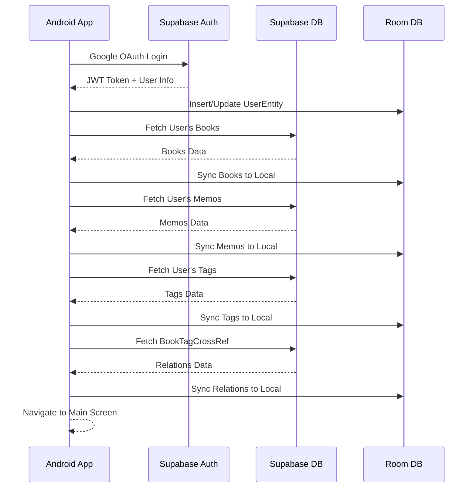
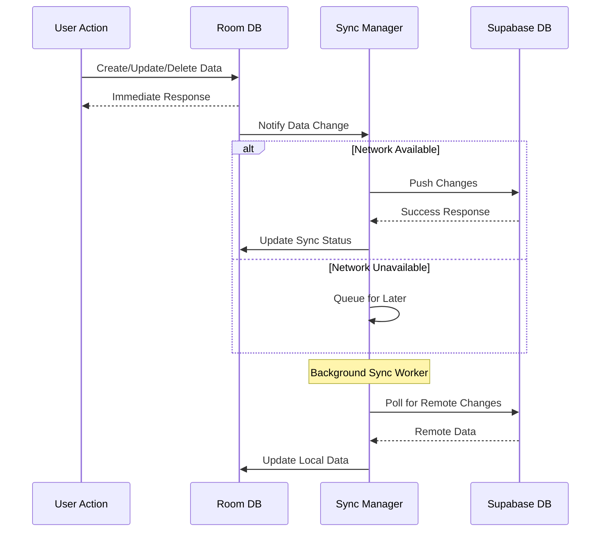

# Supabase ↔ Room DB 동기화 전략

## 전체 아키텍처

```
┌─────────────────┐    ┌─────────────────┐    ┌─────────────────┐
│   Android App   │    │   Supabase      │    │   PostgreSQL    │
│                 │    │   Backend       │    │   Database      │
│  ┌───────────┐  │    │                 │    │                 │
│  │  Room DB  │  │◄──►│  RLS Policies   │◄──►│   Tables        │
│  │  (Local)  │  │    │  Auth System    │    │   (Cloud)       │
│  └───────────┘  │    │  Real-time      │    │                 │
│                 │    │  Subscriptions  │    │                 │
└─────────────────┘    └─────────────────┘    └─────────────────┘
```

## 핵심 원칙

### 1. Offline-First 전략
- **로컬 우선**: 모든 데이터 조작은 Room DB에서 먼저 수행
- **백그라운드 동기화**: 네트워크 상태에 따라 자동으로 Supabase와 동기화
- **충돌 해결**: Last-Write-Wins (최신 수정 시간 우선) 정책

### 2. 인증 기반 동기화
- **Google OAuth**: 사용자 인증 후 Supabase JWT 토큰 획득
- **사용자별 격리**: RLS 정책으로 사용자 데이터만 접근 가능
- **토큰 갱신**: 자동 토큰 갱신으로 지속적인 동기화

## 동기화 워크플로우

### 앱 시작 시 (Initial Sync)



### 실시간 동기화 (Real-time Sync)



## 데이터 플로우

### 1. 인증 플로우
```
Google OAuth → Supabase Auth → JWT Token → Room DB User
```

### 2. 데이터 CRUD 플로우
```
Local Action → Room DB → Sync Queue → Supabase DB
                  ↓
              UI Update (Immediate)
```

### 3. 원격 변경 감지
```
Supabase Realtime → Change Event → Local Update → Room DB
```

## 충돌 해결 전략

### Last-Write-Wins (LWW)
- **기준**: `updated_at` 타임스탬프 비교
- **로직**: 더 최근에 수정된 데이터가 우선
- **적용**: Books, Memos, Tags 모든 엔티티

```kotlin
fun resolveConflict(local: Entity, remote: Entity): Entity {
    return if (local.updatedAt > remote.updatedAt) local else remote
}
```

### 삭제 충돌
- **로컬 삭제 + 원격 수정**: 원격 데이터 복원 (복원 알림)
- **원격 삭제 + 로컬 수정**: 로컬 데이터 Supabase로 재업로드

## 동기화 상태 관리

### SyncStatus Enum
```kotlin
enum class SyncStatus {
    SYNCED,          // 동기화 완료
    PENDING_UPLOAD,  // 업로드 대기
    PENDING_DELETE,  // 삭제 대기
    CONFLICT,        // 충돌 발생
    ERROR            // 동기화 실패
}
```

### 각 엔티티에 동기화 메타데이터 추가
```kotlin
data class SyncMetadata(
    val syncStatus: SyncStatus = SyncStatus.SYNCED,
    val lastSyncAt: Long = 0L,
    val remoteId: String? = null, // Supabase ID
    val conflictData: String? = null // 충돌 시 원격 데이터 JSON
)
```

## 네트워크 최적화

### 1. 배치 동기화
- 개별 요청 대신 배치 단위로 동기화
- 최대 50개 항목씩 그룹화

### 2. 델타 동기화
- `lastSyncAt` 이후 변경된 데이터만 전송
- 불필요한 데이터 전송 최소화

### 3. 압축 및 캐싱
- JSON 데이터 gzip 압축
- 이미지 URL 캐싱 (cover_image_url 등)

## 에러 처리

### 1. 네트워크 에러
- 자동 재시도 (Exponential Backoff)
- 최대 3회 재시도 후 로컬 큐에 보관

### 2. 인증 에러
- JWT 토큰 자동 갱신
- 갱신 실패 시 재로그인 요청

### 3. 데이터 무결성 에러
- 외래키 제약조건 위반 시 관련 데이터 먼저 동기화
- 순환 참조 방지

## 성능 고려사항

### 1. 메모리 관리
- 대용량 데이터 스트리밍 처리
- 페이지네이션으로 데이터 분할 로딩

### 2. 배터리 최적화
- 백그라운드 동기화 주기 조절
- Wi-Fi 연결 시에만 대용량 동기화

### 3. 저장공간 최적화
- 로컬 캐시 크기 제한
- 오래된 동기화 로그 자동 삭제