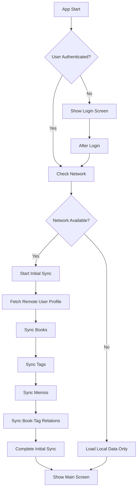
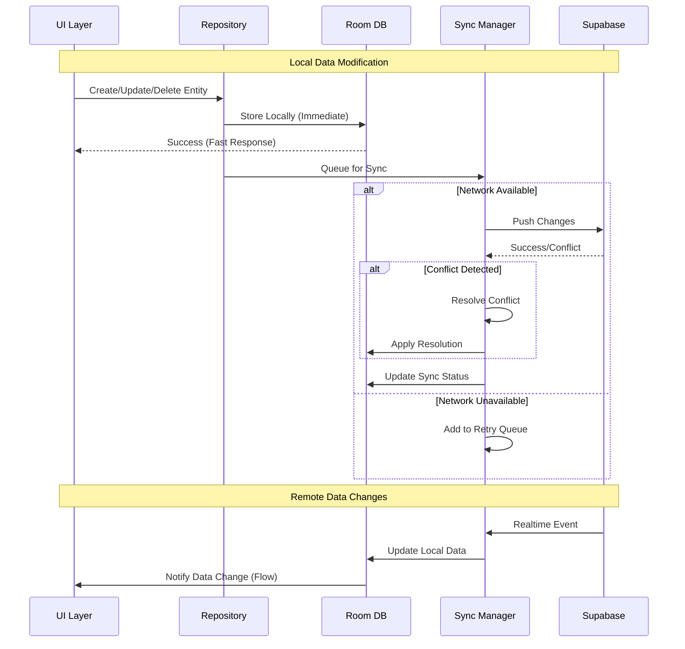
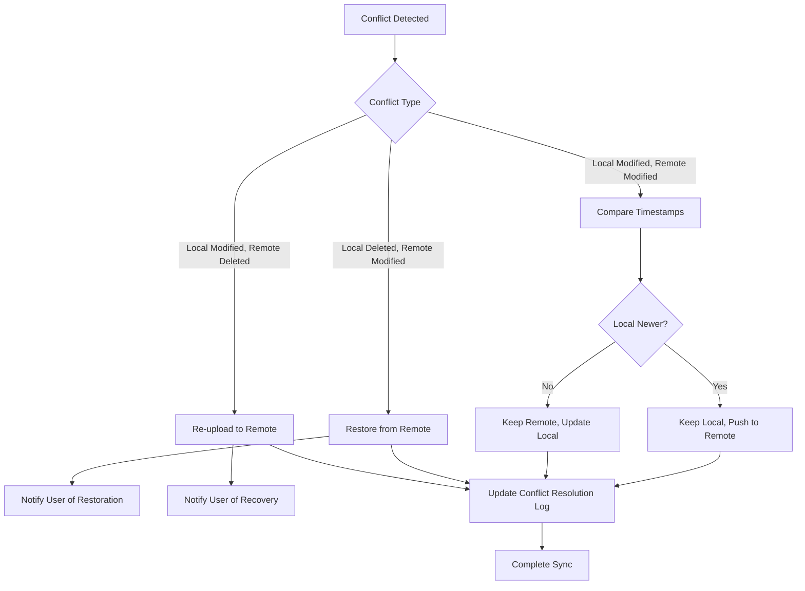

# 데이터 동기화 워크플로우

## 전체 동기화 아키텍처

```
┌─────────────────────────────────┐
│        Android Application      │
├─────────────────────────────────┤
│                                 │
│  ┌─────────────┐ ┌─────────────┐│
│  │    UI       │ │  ViewModel  ││
│  │ Components  │ │   Layer     ││
│  └─────────────┘ └─────────────┘│
│         │               │       │
│         └───────┬───────┘       │
│                 │               │
│  ┌─────────────────────────────┐ │
│  │      Repository Layer      │ │
│  │                             │ │
│  │ ┌─────────┐ ┌─────────────┐ │ │
│  │ │ Local   │ │   Remote    │ │ │
│  │ │ Data    │ │    Data     │ │ │
│  │ │ Source  │ │   Source    │ │ │
│  │ └─────────┘ └─────────────┘ │ │
│  └─────────────────────────────┘ │
│         │               │       │
│         │               │       │
│  ┌─────────────┐ ┌─────────────┐ │
│  │   Room DB   │ │  Supabase   │ │
│  │   (Local)   │ │  (Remote)   │ │
│  └─────────────┘ └─────────────┘ │
└─────────────────────────────────┘
```

## 핵심 컴포넌트

### 1. SyncManager
중앙 동기화 관리자 - 모든 동기화 작업을 조율

```kotlin
interface SyncManager {
    suspend fun performInitialSync(): SyncResult
    suspend fun syncEntity(entityType: EntityType): SyncResult
    fun startRealTimeSync()
    fun stopRealTimeSync()
    val syncStatus: Flow<SyncStatus>
}
```

### 2. EntitySyncer
각 엔티티별 동기화 로직 구현

```kotlin
interface EntitySyncer<T> {
    suspend fun pushLocalChanges(): SyncResult
    suspend fun pullRemoteChanges(): SyncResult
    suspend fun resolveConflicts(): SyncResult
}
```

### 3. SyncWorker
백그라운드 동기화 작업 수행

```kotlin
class SyncWorker(
    context: Context,
    params: WorkerParameters
) : CoroutineWorker(context, params) {
    
    override suspend fun doWork(): Result {
        return when (syncManager.performSync()) {
            is SyncResult.Success -> Result.success()
            is SyncResult.Retry -> Result.retry()
            is SyncResult.Failure -> Result.failure()
        }
    }
}
```

## 동기화 워크플로우 단계

### Phase 1: 초기 동기화 (앱 시작 시)



### Phase 2: 실시간 동기화 (앱 사용 중)



### Phase 3: 충돌 해결 워크플로우



## 구체적인 구현 예시

### 1. BookSyncer 구현

```kotlin
class BookSyncer(
    private val localDataSource: BookDao,
    private val remoteDataSource: SupabaseBookDataSource,
    private val conflictResolver: ConflictResolver<BookEntity>
) : EntitySyncer<BookEntity> {
    
    override suspend fun pushLocalChanges(): SyncResult {
        return try {
            // 1. 로컬에서 변경된 항목 조회
            val pendingBooks = localDataSource.getPendingSync()
            
            // 2. 배치 단위로 원격 서버에 업로드
            val batchSize = 50
            pendingBooks.chunked(batchSize).forEach { batch ->
                val results = remoteDataSource.upsertBatch(batch)
                updateSyncStatus(batch, results)
            }
            
            SyncResult.Success
        } catch (e: Exception) {
            SyncResult.Failure(e)
        }
    }
    
    override suspend fun pullRemoteChanges(): SyncResult {
        return try {
            // 1. 마지막 동기화 시점 이후 변경사항 조회
            val lastSyncTime = getLastSyncTime()
            val remoteBooks = remoteDataSource.getUpdatedSince(lastSyncTime)
            
            // 2. 충돌 감지 및 해결
            val conflicts = detectConflicts(remoteBooks)
            if (conflicts.isNotEmpty()) {
                conflictResolver.resolveConflicts(conflicts)
            }
            
            // 3. 로컬 DB 업데이트
            localDataSource.upsertAll(remoteBooks)
            updateLastSyncTime()
            
            SyncResult.Success
        } catch (e: Exception) {
            SyncResult.Failure(e)
        }
    }
    
    private suspend fun detectConflicts(
        remoteBooks: List<BookEntity>
    ): List<Conflict<BookEntity>> {
        val conflicts = mutableListOf<Conflict<BookEntity>>()
        
        remoteBooks.forEach { remoteBook ->
            val localBook = localDataSource.getById(remoteBook.itemId)
            
            if (localBook != null && 
                localBook.updatedAt != remoteBook.updatedAt &&
                localBook.syncStatus == SyncStatus.PENDING_UPLOAD) {
                conflicts.add(
                    Conflict(
                        local = localBook,
                        remote = remoteBook,
                        type = ConflictType.MODIFY_MODIFY
                    )
                )
            }
        }
        
        return conflicts
    }
}
```

### 2. 실시간 동기화 (Supabase Realtime)

```kotlin
class RealtimeSyncManager(
    private val supabaseClient: SupabaseClient,
    private val syncManager: SyncManager
) {
    
    private var realtimeChannel: RealtimeChannel? = null
    
    fun startRealTimeSync() {
        realtimeChannel = supabaseClient.channel("public-changes") {
            
            // Books 테이블 변경 감지
            postgresChanges(
                event = PostgresAction.All,
                schema = "public",
                table = "books",
                filter = "user_id=eq.${getCurrentUserId()}"
            ) { payload ->
                handleBookChange(payload)
            }
            
            // Memos 테이블 변경 감지  
            postgresChanges(
                event = PostgresAction.All,
                schema = "public", 
                table = "memos",
                filter = "user_id=eq.${getCurrentUserId()}"
            ) { payload ->
                handleMemoChange(payload)
            }
            
            // Tags 테이블 변경 감지
            postgresChanges(
                event = PostgresAction.All,
                schema = "public",
                table = "tags", 
                filter = "user_id=eq.${getCurrentUserId()}"
            ) { payload ->
                handleTagChange(payload)
            }
        }
        
        realtimeChannel?.subscribe()
    }
    
    private suspend fun handleBookChange(payload: PostgresAction) {
        when (payload) {
            is PostgresAction.Insert -> {
                val book = payload.decodeRecord<BookEntity>()
                syncManager.handleRemoteInsert(book)
            }
            is PostgresAction.Update -> {
                val book = payload.decodeRecord<BookEntity>()  
                syncManager.handleRemoteUpdate(book)
            }
            is PostgresAction.Delete -> {
                val bookId = payload.oldRecord["item_id"] as Int
                syncManager.handleRemoteDelete(EntityType.BOOK, bookId)
            }
        }
    }
}
```

### 3. 오프라인 우선 Repository 패턴

```kotlin
class BookRepository(
    private val localDataSource: BookDao,
    private val remoteDataSource: SupabaseBookDataSource,
    private val syncManager: SyncManager
) {
    
    // 모든 책 조회 (로컬 우선)
    fun getAllBooks(): Flow<List<BookEntity>> {
        return localDataSource.getAllBooks()
            .onStart {
                // 백그라운드에서 원격 동기화 시도
                trySync()
            }
    }
    
    // 책 생성 (로컬 즉시 반영)
    suspend fun createBook(book: BookEntity): Result<BookEntity> {
        return try {
            // 1. 로컬 DB에 즉시 저장
            val newBook = book.copy(
                syncStatus = SyncStatus.PENDING_UPLOAD,
                updatedAt = System.currentTimeMillis()
            )
            val bookId = localDataSource.insert(newBook)
            
            // 2. 동기화 큐에 추가
            syncManager.queueForSync(EntityType.BOOK, bookId)
            
            Result.success(newBook)
        } catch (e: Exception) {
            Result.failure(e)
        }
    }
    
    // 책 업데이트 (로컬 즉시 반영)
    suspend fun updateBook(book: BookEntity): Result<BookEntity> {
        return try {
            val updatedBook = book.copy(
                syncStatus = SyncStatus.PENDING_UPLOAD,
                updatedAt = System.currentTimeMillis()
            )
            
            localDataSource.update(updatedBook)
            syncManager.queueForSync(EntityType.BOOK, book.itemId)
            
            Result.success(updatedBook)
        } catch (e: Exception) {
            Result.failure(e)
        }
    }
    
    private fun trySync() {
        // 네트워크 상태 확인 후 동기화 시도
        if (NetworkUtils.isOnline()) {
            syncManager.syncEntity(EntityType.BOOK)
        }
    }
}
```

## 동기화 상태 모니터링

### SyncStatus UI 컴포넌트
```kotlin
@Composable
fun SyncStatusIndicator(
    syncStatus: SyncStatus,
    lastSyncTime: Long?
) {
    Row(
        verticalAlignment = Alignment.CenterVertically,
        modifier = Modifier.padding(8.dp)
    ) {
        Icon(
            imageVector = when (syncStatus) {
                SyncStatus.SYNCED -> Icons.Default.CloudDone
                SyncStatus.SYNCING -> Icons.Default.CloudSync
                SyncStatus.ERROR -> Icons.Default.CloudOff
                SyncStatus.OFFLINE -> Icons.Default.CloudOff
            },
            contentDescription = null,
            tint = when (syncStatus) {
                SyncStatus.SYNCED -> Color.Green
                SyncStatus.SYNCING -> Color.Blue
                SyncStatus.ERROR -> Color.Red
                SyncStatus.OFFLINE -> Color.Gray
            }
        )
        
        Spacer(modifier = Modifier.width(8.dp))
        
        Text(
            text = when (syncStatus) {
                SyncStatus.SYNCED -> "동기화됨 ${formatTime(lastSyncTime)}"
                SyncStatus.SYNCING -> "동기화 중..."
                SyncStatus.ERROR -> "동기화 실패"
                SyncStatus.OFFLINE -> "오프라인"
            },
            style = MaterialTheme.typography.bodySmall
        )
    }
}
```

## 성능 최적화 전략

### 1. 배치 동기화
- 개별 항목 대신 배치 단위로 처리
- 네트워크 요청 횟수 최소화

### 2. 델타 동기화
- 전체 데이터가 아닌 변경된 부분만 동기화
- `lastSyncAt` 타임스탬프 활용

### 3. 백그라운드 동기화
- WorkManager를 사용한 백그라운드 작업
- 배터리 최적화 고려 (주기적 실행)

### 4. 네트워크 최적화
- Wi-Fi에서만 대용량 동기화
- 모바일 데이터에서는 필수 데이터만