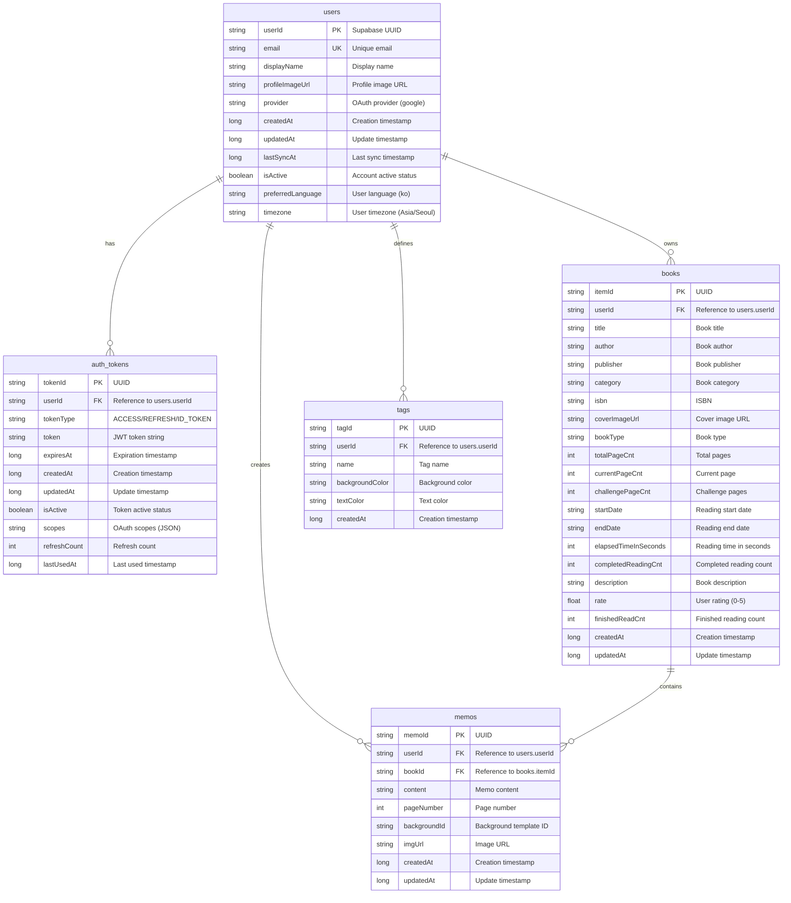

# ODOK Compose Database ERD

## 데이터베이스 개요

ODOK Compose 앱의 데이터베이스는 Room을 사용하여 구현되며, 사용자 인증, 도서 관리, 메모, 태그 기능을 제공합니다.

## ERD (Entity Relationship Diagram)

## 테이블 상세 정보

### 1. users (사용자)
- **Primary Key**: `userId` (String - Supabase UUID)
- **Unique Constraints**: `email`
- **Indexes**: email, isActive, createdAt, lastSyncAt
- **설명**: Supabase 인증을 통한 사용자 정보 저장

### 2. auth_tokens (인증 토큰)
- **Primary Key**: `tokenId` (String - UUID)
- **Foreign Keys**: `userId` → users.userId (CASCADE DELETE)
- **Indexes**: userId, tokenType, expiresAt
- **설명**: JWT 토큰 관리 (ACCESS, REFRESH, ID_TOKEN)

### 3. books (도서)
- **Primary Key**: `itemId` (String - UUID)
- **Foreign Keys**: `userId` → users.userId (NO ACTION)
- **Indexes**: userId, isbn, createdAt
- **설명**: 사용자의 도서 정보 및 읽기 진행상황

### 4. memos (메모)
- **Primary Key**: `memoId` (String - UUID)
- **Foreign Keys**: 
  - `userId` → users.userId (NO ACTION)
  - `bookId` → books.itemId (CASCADE DELETE)
- **Indexes**: bookId, userId
- **설명**: 도서별 사용자 메모

### 5. tags (태그)
- **Primary Key**: `tagId` (String - UUID)
- **Foreign Keys**: `userId` → users.userId (NO ACTION)
- **Indexes**: userId, name, createdAt
- **설명**: 사용자 정의 태그 시스템

## 주요 관계

1. **User → Books**: 1:N 관계 - 한 사용자는 여러 도서를 소유
2. **User → Memos**: 1:N 관계 - 한 사용자는 여러 메모를 작성
3. **User → Tags**: 1:N 관계 - 한 사용자는 여러 태그를 생성
4. **User → AuthTokens**: 1:N 관계 - 한 사용자는 여러 인증 토큰을 가짐
5. **Book → Memos**: 1:N 관계 - 한 도서는 여러 메모를 가질 수 있음

## 데이터베이스 특징

### 보안
- 모든 데이터는 사용자별로 분리 (`userId` 기반)
- 인증 토큰은 별도 테이블에서 관리
- 외래키 제약조건으로 데이터 무결성 보장

### 성능
- 자주 조회되는 컬럼에 인덱스 설정
- UUID 기반 Primary Key로 분산 시스템 호환성
- 적절한 CASCADE 설정으로 데이터 정리 자동화

### 확장성
- Supabase와 호환되는 구조
- 다국어 지원 (preferredLanguage, timezone)
- 소셜 로그인 확장 가능 (provider 필드)

## 동기화 고려사항

- `createdAt`, `updatedAt`, `lastSyncAt` 필드를 통한 동기화 지원
- UUID 기반 ID로 충돌 방지
- 사용자별 데이터 분리로 안전한 동기화